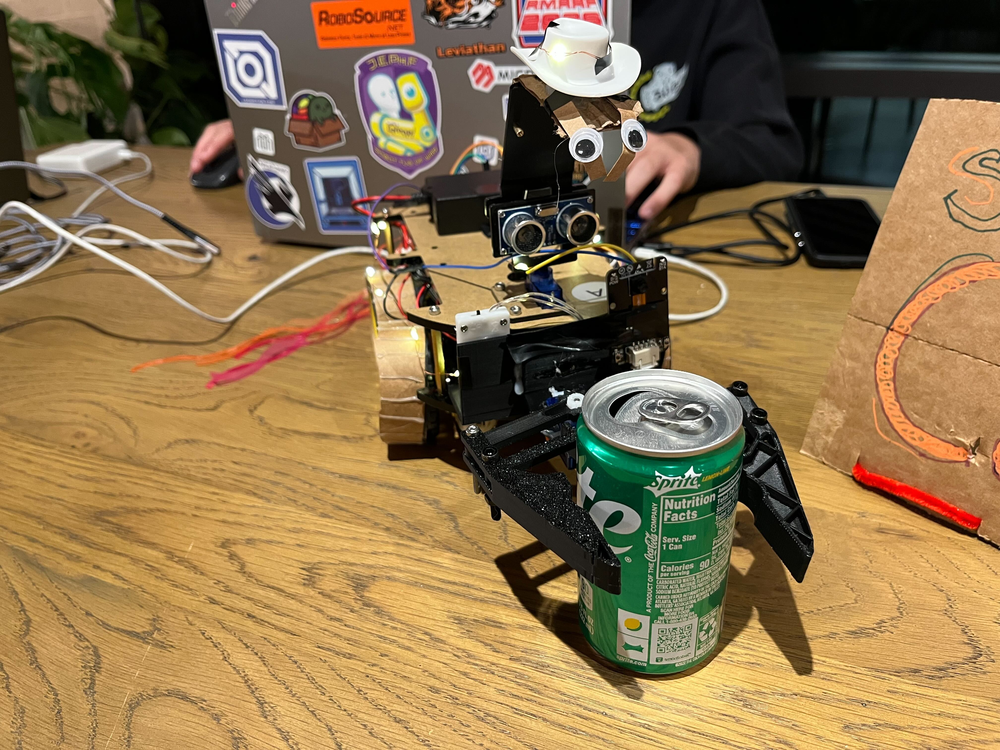
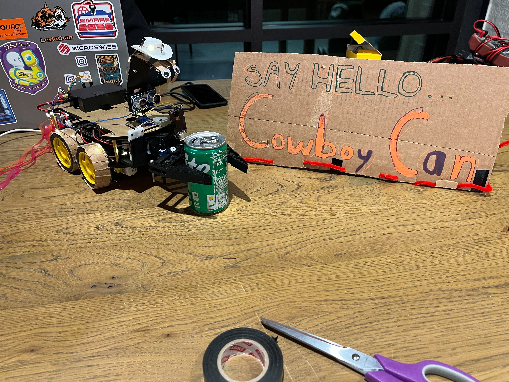
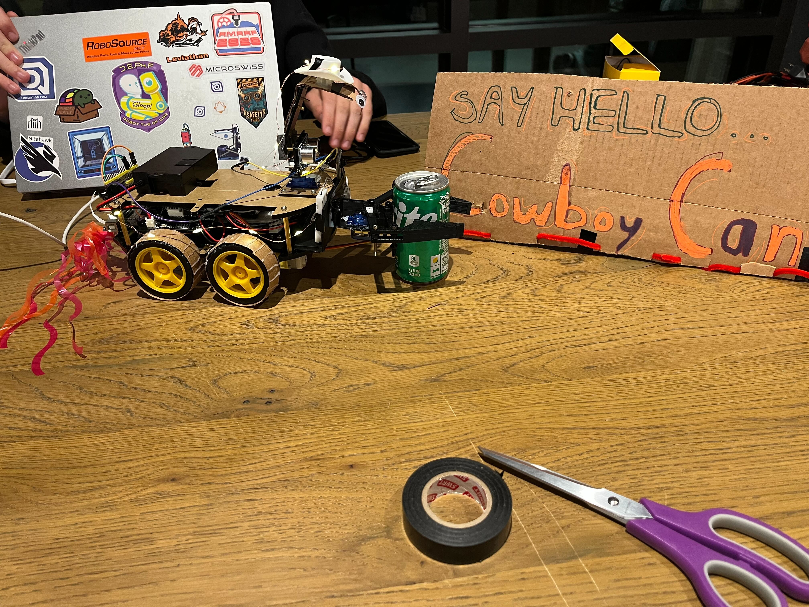
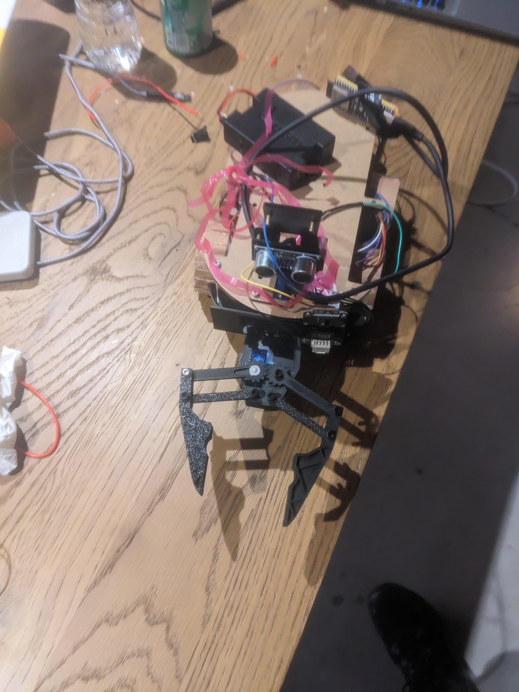
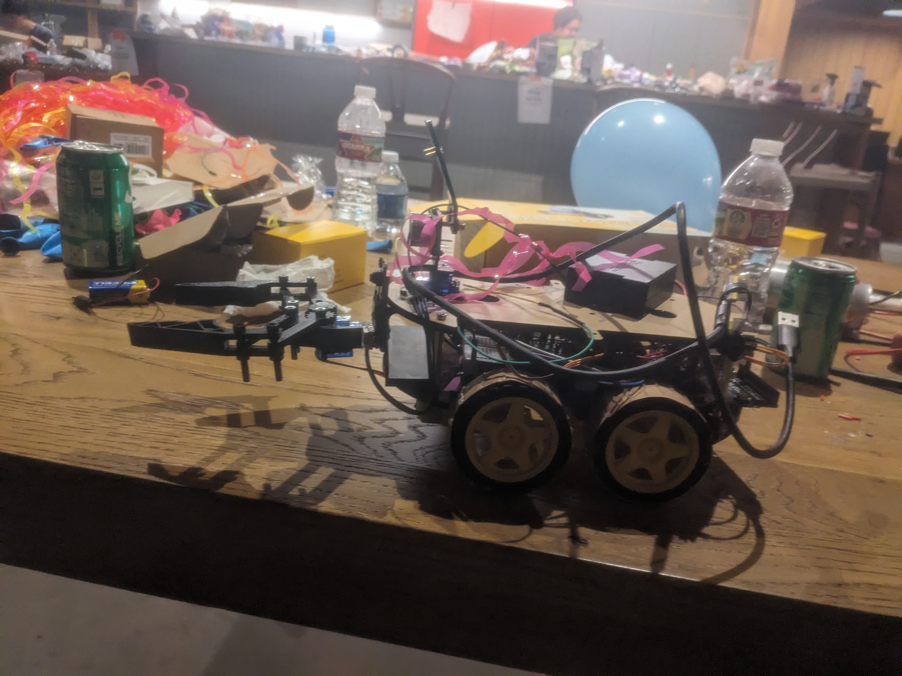
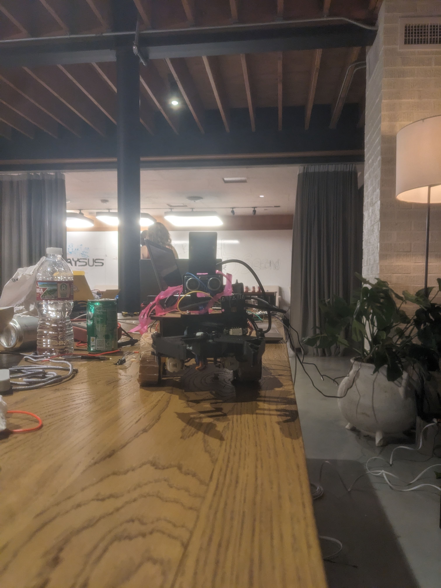
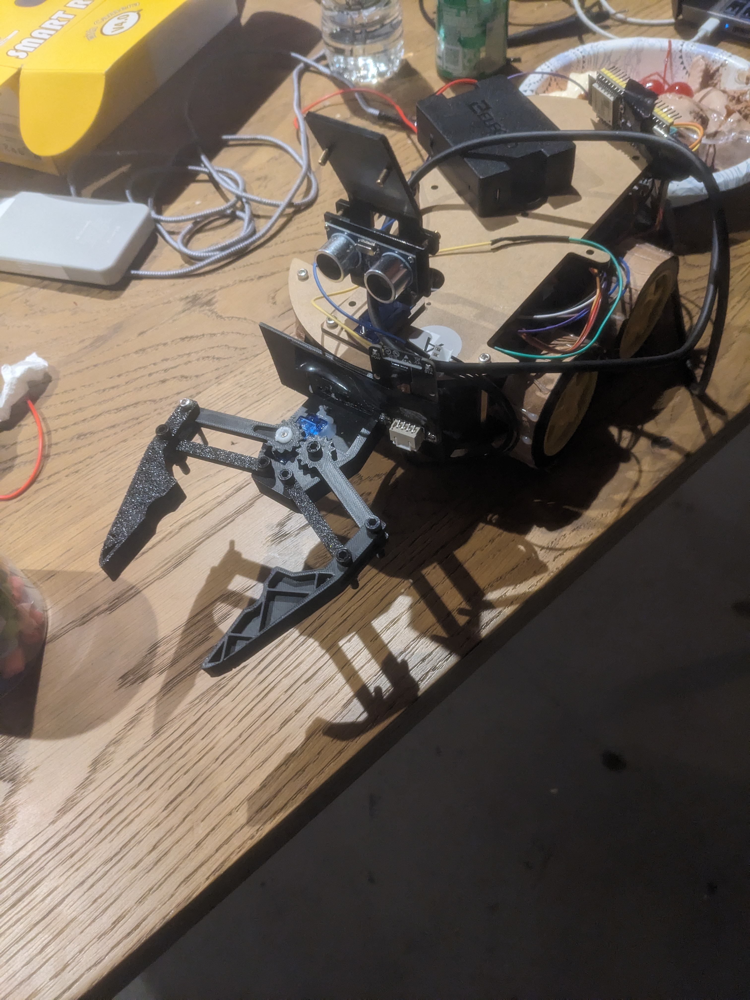

# The-Incredible-Rockasis
CANClean is a roverthat finds, targets and, grabs empty soda cans. I t does this in order to keep your workspace clean and (less)messy.
# Pipeline
An ESP32-CAM takes live camera views and streams them via a TP-Link router(our Stasis Stash item) to my laptop where they are then sent out to roboflow for inference. After inference, the relative position of the can to the rover is calculted by my laptop andthe approach angle and vector are formed. The latop then sends these backto the rover where an Opheus Pico contols the motors to execute the vectors. The laptop then uses the sonar sensor and the camera to detect when the can is inside the claw. Then it closes.
# Demo

# Images

